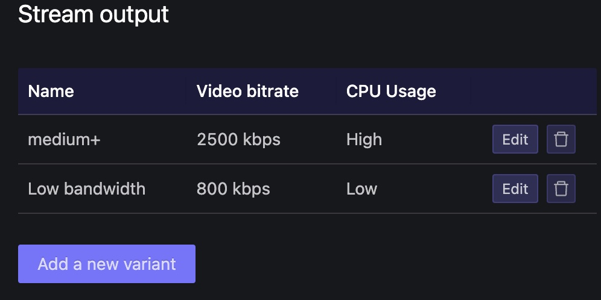
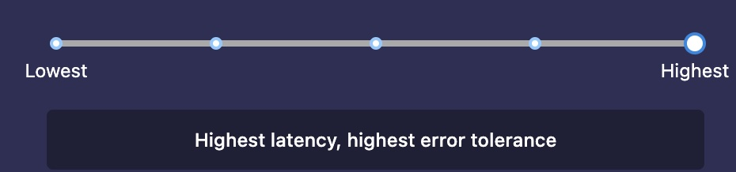

# Ops / Maintainance

Intended for TOPLAP admins. Details on:

* server configurations for muxy
* operational commands to manage services
* stream setup in Owncast
* operational activity used during an event to monitor CPU and stream health
* sending custom email

## Pre-requisites

* ssh access to Linode.com host - local user
* Owncast admin credentials (Live and Test)
* muxy admin credentials
* basic understanding of muxy events/streams, eulerroom infrastructure, video streaming concepts (see main-owncast readme )

### Linode host

* 172.105.92.147 (this may change)
* adding local user (for a new admin)
    * create user with home dir and .ssh/authorized_keys
    * add to groups: docker,eulerroom
    * provide sudo access

## Services

### location: eulerroom-live

When logging into the server, you will need to navigate to the directory where
the the repository is located:

```bash
cd /opt/eulerroom-live
```

Data for the services is stored in the `data` directory.

* `recordings/`: Recordings of live sessions
* `muxy/`: Contains muxy database
* `main-owncast/`: Main Owncast data directory
* `test-owncast/`: Test Owncast data directory

### Check if services are running

You can check if the services are running with the following command:

```bash
docker compose ps
```

### Watch logs

You can check the logs for a specific service with the following command:

```bash
docker compose logs -f $SERVICE_NAME
```

You can also see the logs for all services with:

```bash
docker compose logs -f
```

### Deploy changes

You can deploy changes by pulling the latest changes from the repository and
restarting the services. You can do this with the following commands:

```bash
git pull --recurse-submodules
docker compose up -d --force-recreate --build
```

### Restart a service

If you make a change related to one of the services, you may need to rebuild the
image, recreate the container and restart the service. You can do all this with
a single command. You can also use this command to restart a service that is hung:

```bash
docker compose up -d --force-recreate --build $SERVICE_NAME
docker compose up -d --force-recreate --build nginx-rtmp

```

You can also do it for multiple services or all services

```bash
docker compose up -d --force-recreate --build nginx-rtmp main-owncast
docker compose up -d --force-recreate --build #all services
```

### Nginx config

The Nginx configuration for eulerroom-live is at
`/etc/nginx/sites-available/eulerroom-live`.

If you make changes to this file, you will need to reload the nginx service.
First check if the configuration is correct:

```bash
sudo nginx -t
```

If everything is OK, reload the nginx service:

```bash
sudo nginx -s reload
```

## Owncast Admin

* https://live.eulerroom.com/admin/
* https://test.eulerroom.com/admin/

Most of the Owncast settings will already be set up and configured from the previous event.

### Video stream configuration

This may need to be adjusted per requirements or performance needs of a specific event. In Live, we use 2 output streams, one for regular and one for low bandwidth users. In test, just one output stream at a lower setting.



Latency

We use the highest latency to give the most time for any stream issues to resolve. If a live discussion or panel presentation is used, a lower latency would be more suitable.



### Owncast operations

During live streaming, you can monitor the stream status in Owncast admin. Most of the time this isn't needed, but it becomes really important if there are streaming problems.

* **Home**: Shows details on the incoming stream: bitrate, fps, screen resolution. Use this to determine if the active stream is within recommended parameters. If parameters are high, or very far outside of the recommended values, there will be CPU impacts and possible stream instability.
* **Utilities > Stream Health**: There are a set of graphic reports here and a summary of general stream health. These become more useful as the event goes on and more data points are included.

## Linode host operations

### Resize
Linode supports node resizing. This is a great way to keep cost down and still be able to scale up for a big event.

* Linode 4 GB / 2 cores - adequate for testing without high load streams
* Linode 8 GB / 4 cores - adequate for most streaming events
* Linode 16 GB / 6 cores  lots of headroom. For TOPLAP20 we used this and the 1 min load average did not go above 4 (out of 6) and only sometimes went above 3.

When select a new size, be sure to **uncheck the option to Auto Resize Disk.**

### CPU utilization
CPU is the most important compute resource for live video streaming. If there isn't enough CPU capacity, the outgoing stream can become choppy or cut out completely due to buffering constraints. The Owncast admin site monitors CPU at a high level. For a more precise view of CPU utilization, use the linux `top` command.

* watch the load average closely: last min, last 5 mins, last 15 mins
The load avg is relative to the number of CPU cores. With 2 cores, the max load is 2, with 4 cores it's 4.
* ffmpeg processes will dominate CPU capacity during a video stream.
* When Test and Live are both streaming, 2 ffmpeg processes will run
* CPU impact of incoming stream factors:
    * Output screen resolution: this has the most dramatic impact on CPU utilization. When it exceeds 1920x1080, CPU will go up dramatically
    * fps rate of 30 increases CPU, fps 60 will push it up 20 - 40 %
    * video bitrate will impact CPU but to a much less extent

### Custom email

Commands are available to send custom email to anyone with a stream slot, or to all stream slots for a specific muxy event. This is a very useful way to communicate with everyone both prior and during an event. For example to remind everyone use the docs and test their streams, or to communicate during an event about problems or changes being made.

On the Linode eulerroom host:
* `cd /opt/eulerroom-live/`
* Create a text file with the message contents:
    * `/opt/eulerroom-live/muxy/emails/reminder.txt`

```bash
# Sends the message in "reminder.txt" to stream ID 1417 of event 22.
docker compose exec muxy ./manage.py notify_publishers --event 22 --subject "TOPLAP20 Reminders" --template ./emails/reminder.txt --streams 1417

# Sends the message to all streams of event 22
docker compose exec muxy ./manage.py notify_publishers --event 22 --subject "TOPLAP20 Reminders" --template ./emails/reminder.txt

```
Note that the command must be executed from the root eulerroom directory (`/opt/eulerroom-live/`) but the template path is relative to the `muxy` subfolder.

### backups
Backups are configured via the Linux service **backupninja** and write data out to the Linode host `toplap-hometown` 85.90.244.99 at: `/home/eulerroom-backups/backups`. To view or edit the backup configurations:

```bash
sudo ninjahelper
```

1. system backup
2. data backup to tarfile of:
    * `/opt/eulerroom-live/data/main-owncast`
    * `/opt/eulerroom-live/data/muxy` # has sqlite of muxy events
3. sync
