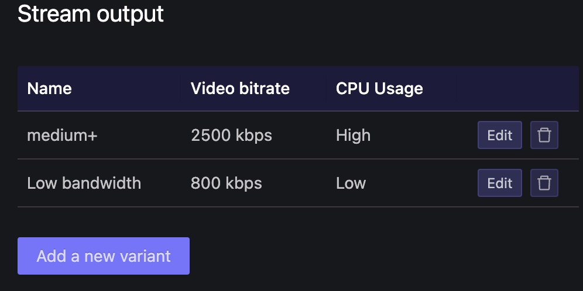
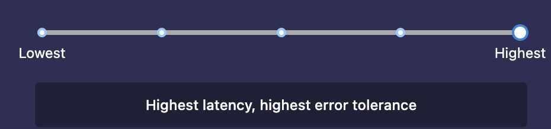

# Ops / Maintainance

Intended for TOPLAP admins. Details on:

* server configurations for muxy
* operational commands to manage services
* stream setup in Owncast
* operational activity used during an event to monitor CPU and stream health
* sending custom email

Related Documentation:

* [Event setup with Muxy Admin](https://github.com/EulerRoom/eulerroom-live-web/blob/main/eventSetup.md) This details how to create a streaming event in Muxy Admin, manage slots, and set the webpage for slot registration.
* [OBS Settings Guide](https://github.com/EulerRoom/eulerroom-live-web/blob/main/obsSettings.md) Reference for OBS software setup for streaming.
* [Streaming Event Admin Support Guide](support.md) Companion guide. Covers info on providing user support and systems support during an event. 


## Pre-requisites

* ssh access to Linode.com host - local user
* Owncast admin credentials (Live and Test)
* muxy admin credentials
* basic understanding of muxy events/streams, eulerroom infrastructure, video streaming concepts (see main-owncast readme )

### Linode host

* `85.90.244.99`
* adding local user (for a new admin)
    * create user with home dir and .ssh/authorized_keys
    * add to groups: docker,eulerroom
    * provide sudo access

```
sudo adduser <username>
```
```
 usermod -a -G sudo,docker,eulerroom
```

> Note: adduser (and addgroup) are friendlier front ends to the  low  level tools like useradd, groupadd and usermod programs, by default choosing Debian policy conformant UID and GID values, creating a home directory with skeletal configuration, running a custom script, and other features.

## Services

### location: eulerroom-live

When logging into the server, you will need to navigate to the directory where
the the repository is located:

```bash
cd /opt/eulerroom-live
```

Data for the services is stored in the `data` directory.

* `recordings/`: Recordings of live sessions
* `muxy/`: Contains muxy database
* `main-owncast/`: Main Owncast data directory
* `test-owncast/`: Test Owncast data directory

### Docker services:

These are the running services. Use these names in the commands below for `$SERVICE_NAME`.
* nginx-rtmp
* main-owncast
* test-owncast
* muxy

### Check if services are running

You can check if the services are running with the following command:
*Note:* This needs to be run from `/opt/eulerroom-live`

```bash
docker compose ps
```

### Watch logs

You can check the logs for a specific service with the following command:

```bash
docker compose logs -f $SERVICE_NAME
```

You can also see the logs for all services with:

```bash
docker compose logs -f
```

### Deploy changes

You can deploy changes by pulling the latest changes from the repository and
restarting the services. You can do this with the following commands:

```bash
git pull --recurse-submodules
docker compose up -d --force-recreate --build
```

### Restart a service

If you make a change related to one of the services, you may need to rebuild the
image, recreate the container and restart the service. You can do all this with
a single command. You can also use this command to restart a service that is hung:

```bash
docker compose up -d --force-recreate --build $SERVICE_NAME
docker compose up -d --force-recreate --build nginx-rtmp

```

You can also do it for multiple services or all services

```bash
docker compose up -d --force-recreate --build nginx-rtmp main-owncast
docker compose up -d --force-recreate --build #all services
```

### Change the website

Normally, owncast doesn't autoplay streams. This is bad news for us as it would mean that stream watchers would have to press the play button for every performance slot. 

To fix this and/or make cosmetic changes to the front end, we have to edit the website.

First, clone the owncast repo, and switch to the version we're running:

```bash
cd ~
mkdir src
cd src
git clone https://github.com/owncast/owncast`
cd owncast
git checkout v0.2.3
```

Then edit `web/components/video/OwncastPlayer/OwncastPlayer.tsx` to edit the `autoplay` option to `true`.

You'll also need to edit the `Dockerfile`, to set the user and group ids of the eulerroom user. You can find these ids with the `id eulerroom` command. For example if the user and group ids are both `1005`, you'd change the RUN `addgroup line` to:

```
RUN addgroup -g 1005 -S owncast && adduser -u 1005 -S owncast -G owncast
```

Next we build and bundle the web stuff, and rebundle the owncast container, tagged eulerroom:
```bash
./build/web/bundleWeb.sh
docker build -t owncast:eulerroom .
```
Now edit our `/opt/eulerroom-live/owncast/Dockerfile` to change the first line to `FROM owncast:eulerroom`, and recreate the main and test containers with:

```bash
cd /opt/eulerroom-live
docker compose up -d --force-recreate --build main-owncast
docker compose up -d --force-recreate --build test-owncast
```

### Nginx config

The Nginx configuration for eulerroom-live is at
`/etc/nginx/sites-available/eulerroom-live`.

If you make changes to this file, you will need to reload the nginx service.
First check if the configuration is correct:

```bash
sudo nginx -t
```

If everything is OK, reload the nginx service:

```bash
sudo nginx -s reload
```

## Owncast Admin

* https://live.eulerroom.com/admin/
* https://test.eulerroom.com/admin/

Most of the Owncast settings will already be set up and configured from the previous event.

### Video stream configuration

This may need to be adjusted per requirements or performance needs of a specific event. In Live, we use 2 output streams, one for regular and one for low bandwidth users. In test, just one output stream at a lower setting.



Latency

We use the highest latency to give the most time for any stream issues to resolve. If a live discussion or panel presentation is used, a lower latency would be more suitable.



### Owncast operations

During live streaming, you can monitor the stream status in Owncast admin. Most of the time this isn't needed, but it becomes really important if there are streaming problems.

* **Home**: Shows details on the incoming stream: bitrate, fps, screen resolution. Use this to determine if the active stream is within recommended parameters. If parameters are high, or very far outside of the recommended values, there will be CPU impacts and possible stream instability.
* **Utilities > Stream Health**: There are a set of graphic reports here and a summary of general stream health. These become more useful as the event goes on and more data points are included.

## Linode host operations

### Resize
Linode supports node resizing. This is a great way to keep cost down and still be able to scale up for a big event. Linode offers a warm or cold resize option. Warm resizing minimizes down time but does include a power off / reboot cycle. See the [Linode - Change Plans/resize Guide](https://www.linode.com/docs/products/compute/compute-instances/guides/resize/).

* Linode 2 GB / 1 core: ok for Mastodon, can do minimal testing 
* Linode 4 GB / 2 cores - adequate for testing without high load streams
* Linode 8 GB / 4 cores - adequate for some streaming events
* **Linode 16 GB / 6 cores** Recommended. lots of headroom. Will handle all streaming events.

*Note*: Running the streaming stack together with Mastodon means occasional extra CPU load. For this scenario, the **Linode 16 GB** is recommended. When a user sends a heavy load stream in, it can max out the 8GB / 4 core server and result in buffering problems with frequent stream interruptions. If we could count on everyone following the published guidelines, 8 GB / 4 cores would be enough. 

**Resize steps**

* Log in to the Linode Cloud Manager (UI)
* select the linode host (toplap-hometown)
* from the 3 dot menu, select Resize
* you will probably want to check the option to Auto Resize Disk, if there is not enough room for recordings otherwise. however ...
* when downgrading
  * if you resized the disk when upgrading, review the storage used to make sure it doesn't exceed the new smaller disk size. The big factor will be any recordings files from live streaming. These are in: `/opt/eulerroom/data/recordings`.
  * power the linode off, and resize the storage the target plan. For the plan with 50GB storage, that would be 50688. 50 GB = 51200 MB, and with 512 MB reserved for swap, that makes 50688.
  * you will need to power the linode back on, before doing a 'warm' resize with minimal downtime.

### CPU utilization
CPU is the most important compute resource for live video streaming. If there isn't enough CPU capacity, the outgoing stream can become choppy or cut out completely due to buffering constraints. The Owncast admin site monitors CPU at a high level. For a more precise view of CPU utilization, use the linux `top` command.

* watch the load average closely: last min, last 5 mins, last 15 mins
The load avg is relative to the number of CPU cores. With 2 cores, the max load is 2, with 4 cores it's 4.
* ffmpeg processes will dominate CPU capacity during a video stream.
* When Test and Live are both streaming, 2 ffmpeg processes will run
* CPU impact of incoming stream factors:
    * Output screen resolution: this has the most dramatic impact on CPU utilization. When it exceeds 1920x1080, CPU will go up dramatically
    * fps rate of 30 increases CPU, fps 60 will push it up 20 - 40 %
    * video bitrate will impact CPU but to a much less extent

### Custom email

Commands are available to send custom email to anyone with a stream slot, or to all stream slots for a specific muxy event. This is a very useful way to communicate with everyone both prior and during an event. For example to remind everyone use the docs and test their streams, or to communicate during an event about problems or changes being made.

On the Linode eulerroom host:
* `cd /opt/eulerroom-live/`
* Create a text file with the message contents:
    * `/opt/eulerroom-live/muxy/emails/reminder.txt`

```bash
# Sends the message in "reminder.txt" to stream ID 1417 of event 22.
docker compose exec muxy ./manage.py notify_publishers --event 22 --subject "TOPLAP20 Reminders" --template ./emails/reminder.txt --streams 1417

# Sends the message to all streams of event 22
docker compose exec muxy ./manage.py notify_publishers --event 22 --subject "TOPLAP20 Reminders" --template ./emails/reminder.txt

```
Note that the command must be executed from the root eulerroom directory (`/opt/eulerroom-live/`) but the template path is relative to the `muxy` subfolder.

### backups
Backups are configured via the Linux service **backupninja** and write data out to the Linode host `toplap-hometown` 85.90.244.99 at: `/home/eulerroom-backups/backups`. To view or edit the backup configurations:

```bash
sudo ninjahelper
```

1. system backup
2. data backup to tarfile of:
    * `/opt/eulerroom-live/data/main-owncast`
    * `/opt/eulerroom-live/data/muxy` # has sqlite of muxy events
3. sync
