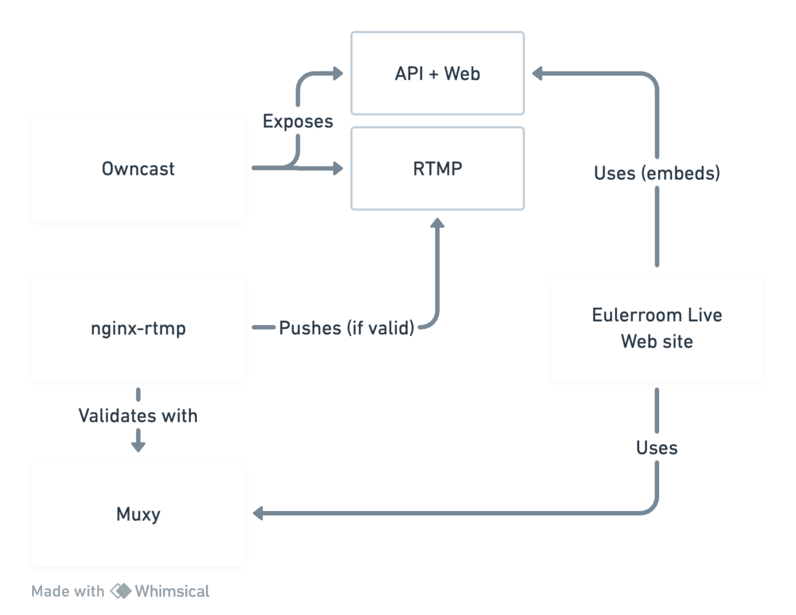
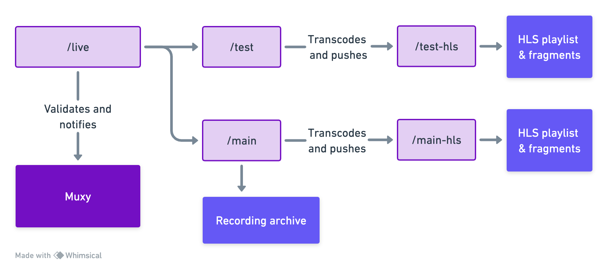

# eulerroom-live

[Eulerroom](https://live.eulerroom.com/)'s self-hosted setup for live streaming
events.

We use [Owncast](https://owncast.online/),
[nginx-rtmp](https://github.com/arut/nginx-rtmp-module) and
[Muxy](https://github.com/munshkr/muxy).

See [eulerroom-live-web](https://github.com/EulerRoom/eulerroom-live-web) for
the website frontend.

## Installation

We use Git submodules for some of the modules, like the frontend and muxy, so
make sure to clone this repository like this:

```bash
git clone --recurse-submodules
```

Whenever you need to pull for changes, also make sure to run:

```bash
git pull --recurse-submodules
```

There is a Docker Compose config file to quickly set things up. You will need to
have Docker and Docker Compose installed.

First, build and pull images:

```bash
docker compose build
```

On `muxy/`, copy the `.env.sample` file to `.env` and fill in the necessary
environment variables to configure Muxy:

```bash
cp muxy/.env.sample muxy/.env
```

Check [Muxy](https://github.com/munshkr/muxy?tab=readme-ov-file#initial-configuration)
for more information.

Do the same for the Web service at `web/`, but this time, copy `.env` as
`.env.local`:

```bash
cp web/.env web/.env.local
```

You will configure it later.

To initialize Muxy, run the following commands to set up the database:

```
docker compose run --rm muxy ./manage.py migrate
docker compose run --rm muxy ./manage.py collectstatic
```

Finally, start the services:

```
docker compose up -d
```

Check the logs to see if everything is running:

```
docker compose logs -f
```

In case you're installing this already on a remote server, you may want to
run an SSH tunnel to access the administration panels first via your local
machine:

```bash
ssh -L 8000:localhost:8000 -L 8081:localhost:8081 -L 8082:localhost:8082 myhost.com
```

Once you have configured the main nginx server on your remote host, you can
close the tunnel.

### Muxy configuration

You will need to create a superuser to access the admin panel. Run the following
command and follow the instructions:

```bash
docker compose run --rm muxy ./manage.py createsuperuser
```

You can access the admin panel on http://localhost:8000/admin

You will also need to create a Muxy API key, which you can do on the admin
panel. Make sure to create a "Web" API key, which has less permissions than the
standard API key.  Take note of the key, as you will need it to configure the
web app.

### Web configuration

For the web app, you will need to set the Muxy API key and other variables.

Inside the `web/` directory, copy the `.env` file to `.env.local`:

```bash
cp web/.env web/.env.local
```

Check [eulerroom-live-web]([web/README.md](https://github.com/EulerRoom/eulerroom-live-web?tab=readme-ov-file#install))
for more information.

### Owncast configuration

You must configure both instances of Owncast: main and test.

* Main: http://localhost:8081/admin
* Test: http://localhost:8082/admin

Use `admin` / `abc123` to enter (remember to change the passwords!).

You will need to create a stream key for each instance. Go to the Stream Keys
section and create a new key. It's recommended to have two different keys
for each instance.  Take note of the keys, as you will need to set them in the
`nginx-rtmp` configuration (see below).

**NOTE: Do not change the RTMP port and Owncast port in the Server Configuration
section. They must be set to 1935 and 8080, respectively**.  The Docker Compose
file maps the ports to the host machine. If you want to change the ports facing
the host machine, you will need to change the `docker-compose.yml` file.

### nginx-rtmp configuration

Create a stream key in each Owncast instance and set them in the `.env` file in
`nginx-rtmp`. You can copy the `.env.sample` file to `.env` and fill in the
necessary environment variables:

```bash
cp nginx-rtmp/.env.sample nginx-rtmp/.env
```

To take effect, you will need to restart the `nginx-rtmp` service:

```bash
docker compose restart nginx-rtmp
```

### Main nginx configuration

You will need to configure the main nginx server to serve the web app and the
Owncast instances from a single domain. You can use the `nginx.conf` file as a
base and modify it to your needs.

```bash
sudo cp nginx.conf /etc/nginx/sites-available/eulerroom-live
sudo ln -s /etc/nginx/sites-available/eulerroom-live /etc/nginx/sites-enabled/eulerroom-live
```

Check if the configuration is correct:

```bash
nginx -t
```

If everything is OK, reload the nginx service:

```bash
sudo nginx -s reload
```

## Usage

Run `docker compose up -d` to start all services.

## Description

### High-level services



### nginx-rtmp application flow



## Deployment

**TODO**: Show how to...
* Start all services with Docker Compose (and start them on boot)
* Configure nginx to set up all web services

## License

The source code in this repository is licensed under the GNU Affero General
Public License v3.0. See the [LICENSE](LICENSE) file for details.
