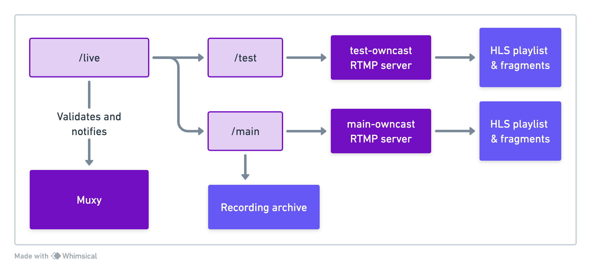

# eulerroom-live

[Eulerroom](https://live.eulerroom.com/)'s self-hosted setup for live streaming
events.

We use [Owncast](https://owncast.online/),
[nginx-rtmp](https://github.com/arut/nginx-rtmp-module) and
[Muxy](https://github.com/munshkr/muxy).

See [eulerroom-live-web](https://github.com/EulerRoom/eulerroom-live-web) for
the website frontend.

## Installation

We use Git submodules for some of the modules, like the frontend and muxy, so
make sure to clone this repository like this:

```bash
git clone --recurse-submodules https://github.com/EulerRoom/eulerroom-live.git
```

Whenever you need to pull for changes, also make sure to run:

```bash
git pull --recurse-submodules
```

*Note*: You can modify and push changes from withing the cloned submodules in
this repo.  In that case, you may want to add this settings in your
`~/.gitconfig` to replace the `https` URLs for `ssh`, so it uses your SSH key
(provided you have the proper access to these repos):

```
[url "ssh://git@github.com/"]
    insteadOf = https://github.com/
```

Read more about this option [here](https://git-scm.com/docs/git-config#Documentation/git-config.txt-urlltbasegtinsteadOf).

There is a Docker Compose config file to quickly set things up. You will need to
have Docker and Docker Compose installed.

First, build and pull images:

```bash
docker compose build
```

Run the following lines to create custom env files for customizing settings on
each service:

```bash
cp env.sample .env
cp muxy/env.sample muxy/.env
```

Use this command twice, to generate 2 random stream keys for the Owncast
instances:

```bash
openssl rand -hex 16
```

Copy these keys into the `.env` file at the root. You need different keys for
each Owncast instance (main and test).  You can skip configuring the other
`.env` files for now (see Configuratio section below).

To initialize Muxy, run the following commands to set up the database:

```bash
docker compose run --rm muxy ./manage.py migrate
docker compose run --rm muxy ./manage.py collectstatic
```

Finally, start the services:

```bash
docker compose up -d
```

Check the logs to see if everything is running:

```bash
docker compose logs -f
```

In case you're installing this already on a remote server, you may want to run
an SSH tunnel on your local machine, to access the administration panels first:

```bash
ssh -L 8000:localhost:8000 -L 8081:localhost:8081 -L 8082:localhost:8082 eulerroom.com
```

Once you have configured the main public nginx server on your remote host, you
can close the tunnel and access directly through your host domain.

By default, all data will be stored in the `data/` directory on the cloned repo.
If you want to change the location, you should modify the Docker compose file,
in particular the `volumes` settings on each service.

### Muxy configuration

You will need to create a superuser to access the admin panel. Run the following
command and follow the instructions:

```bash
docker compose run --rm muxy ./manage.py createsuperuser
```

You can access the admin panel on http://localhost:8000/admin

You will also need to create a Muxy API key for the web frontend, which you can
do on the admin panel. Make sure to create a "Web" API key, which has less
permissions than the standard API key.  Take note of the key, as you will need
it to configure the web app.

In case you also modified something in your `.env` file, to take effect, restart
the service:

```bash
docker compose restart muxy
```

### Owncast configuration

You must configure both instances of Owncast: main and test.

* Main: http://localhost:8081/admin
* Test: http://localhost:8082/admin

Use `admin` / `abc123` to enter (remember to change the passwords!).

**NOTE: Do not change the RTMP port and Owncast port in the Server Configuration
section.**.  The Docker Compose file maps the ports to the host machine. If you
want to change the ports facing the host machine, you will need to change the
`docker-compose.yml` file.

## Description

### High-level services


### nginx-rtmp application flow



## Deployment

This instructions are for deploying the services on a remote server. You will
need to have a domain and a server with Docker and Docker Compose installed. You
will also need to install and configure Nginx to serve the HTTP services.

It's also expected to have subdomains for each of the services already pointing
to the IP of the remote server. For example:

* `eulerroom.com` - Main Owncast instance
* `test.eulerroom.com` - Test Owncast instance
* `muxy.eulerroom.com` - Muxy

### Docker Compose

The `docker-compose.yml` file is used to start all services. You can use the
following commands to manage the services:

* `docker compose up -d` - Start all services
* `docker compose down` - Stop all services
* `docker compose restart` - Restart all services
* `docker compose logs -f` - Show logs for all services
* `docker compose ps` - Show the status of all services
* `docker compose build` - Build all services

You can specify a service to manage by adding the service name at the end of the
command. For example:

* `docker compose restart nginx-rtmp` - Restart nginx-rtmp

All services have a restart policy set to `always`, so they will start on boot
and restart if they crash.  Make sure to enable the Docker service to start on
boot.

### Nginx

You will need to configure the main nginx server to serve the web app and the
Owncast instances from a single domain. You can use the `nginx.conf` file as a
base and modify it to your needs.

```bash
sudo cp nginx.conf /etc/nginx/sites-available/eulerroom-live
sudo ln -s /etc/nginx/sites-available/eulerroom-live /etc/nginx/sites-enabled/eulerroom-live
```

Check if the configuration is correct:

```bash
sudo nginx -t
```

If everything is OK, reload the nginx service:

```bash
sudo nginx -s reload
```

### SSL certificate / https

If you want to serve the services over https, you will need to obtain a
certificate from a certificate authority. You can use Let's Encrypt to obtain a
free certificate.  Follow the instructions on their
[website](https://certbot.eff.org/) to install the certbot tool.

Then, run:

```bash
sudo certbot --nginx
```

Follow the instructions to obtain the certificate. Certbot will also configure
the nginx server to use the certificate.

## License

The source code in this repository is licensed under the GNU Affero General
Public License v3.0. See the [LICENSE](LICENSE) file for details.
